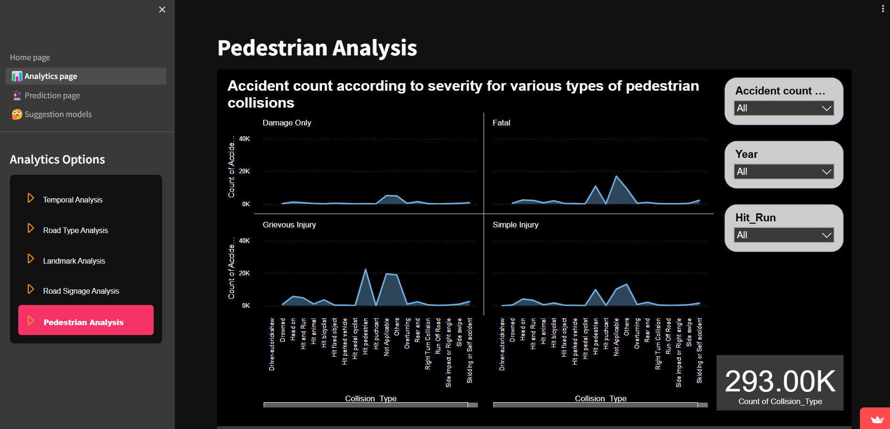

#  Lifeline: Accident Data Analysis for Karnataka State Police Hackathon <link href="https://life-line.streamlit.app/">
<p align="right">(<a href="https://life-line.streamlit.app/">View the Deployed Project</a>)</p>


# Problem Statement
Traditional methods of accident data analysis often lack insights into patterns and contributing factors, limiting the effectiveness of preventive measures. Despite the vast volume of data collected by the police relating to accidents, this data is often underutilized for analysis and prediction purposes. Our challenge is to develop an advanced data analysis system, named Lifeline, which can identify accident patterns, high-risk locations, and contributing factors such as weather, road conditions, and driver behavior. By doing so, we aim to inform targeted safety interventions and infrastructure improvements to reduce the occurrence and severity of accidents.

# Approach
After critically assessing the problem statement and reviewing relevant research papers, we devised a comprehensive approach to address the challenge. Our analysis encompasses various variables including the time of accident, driver demographics, vehicle characteristics, location, and weather conditions. By examining these factors, we aim to identify patterns and correlations that can help predict future occurrences of accidents and understand their root causes.

# Key Features
Comprehensive Data Analysis: Lifeline analyzes accident data to determine the causes of accidents and identify contributing factors, whether related to driver behavior or road infrastructure. \
Spatial and Temporal Distribution: By recognizing spatial and temporal distributions of accidents, Lifeline helps in planning interventions and targeting safety measures effectively. \
Severity Classification: Accidents are categorized into fatal, serious injury, or light injury cases, enabling policymakers to develop appropriate prevention strategies and enhance emergency response protocols. \
Prediction Model: Lifeline utilizes a hybrid model consisting of K-Means clustering and Random Forest classification to predict the severity of road traffic accidents. This approach improves accuracy compared to traditional algorithms.
# Impact
The Lifeline project aims to make a significant impact on road safety by providing Karnataka State Police with actionable insights derived from accident data analysis. By identifying patterns, high-risk locations, and contributing factors, Lifeline empowers authorities to implement targeted interventions and infrastructure improvements, ultimately saving lives and reducing the number of accidents on Karnataka's roads.
<p align="right">(<a href="#readme-top">back to top</a>)</p>

# Get Involved
We welcome collaboration and contributions to the Lifeline project. Whether you're a data scientist, policymaker, or road safety advocate, your expertise and insights can help make our roads safer for everyone. Reach out to us to learn more about how you can get involved in this important initiative.
<p align="right">(<a href="#readme-top">back to top</a>)</p>

# Contributors

Yash Patle \
Nikhil Dhande \
Vinay Kamdi  \
Vaidehi Thool 


<p align="right">(<a href="#readme-top">back to top</a>)</p>

## Tech Used


**Python Libraries:** Streamlit,Flask,Follium,Plotlib,sklearn,keplergl,google.generativeai

**Server** Cloud Application,gemini_api


<p align="right">(<a href="#readme-top">back to top</a>)</p>
## Installation 
To install the requirements of project python should be installed  optional 3.11.9

## Optional
You can use the venv or u can either run it in the console 

```bash
   python -m venv venv
   venv/Scripts/activate
```
## Dependances
```bash
  pip install -r requirements.txt
```


## Deployment

To deploy this project run

```bash
    streamlit homepage.py
```

<p align="right">(<a href="#readme-top">back to top</a>)</p>


# ScreenShots

## Main Dashboard  District,Year slicer


## Pridiction of Black Spot with respect to distrcts


## Pridiction of Grey zones with respects to distrcts


## Cluster based Heatmap


## Suggestion Models Ai Recomdation

 # AI output


## Suggestion Models Most Impactful factor

## Suggestion Models Most Impactful factor AI suggestions

## Suggestion Models Most Impactful factor options


## open 360  road View


## Power bi reports




